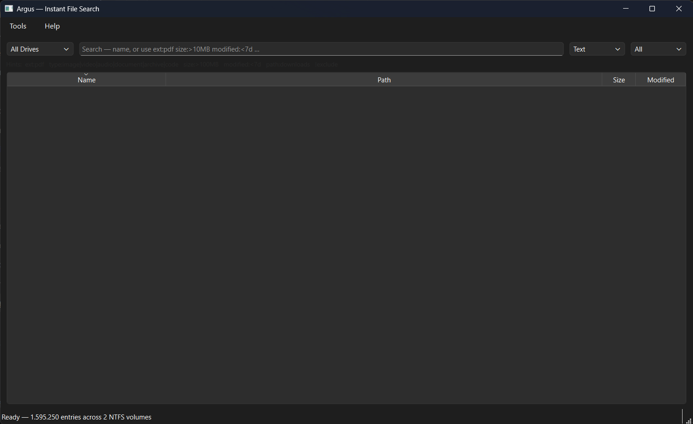

# Argus

*"The hundred-eyed giant — nothing escapes him."*

**Instant file search for Windows.** Reads the NTFS Master File Table directly —
no background indexer, no external services. Written in C++20 with a native
Qt6 GUI.



**Status:** v0.6.0 released — indexes millions of files across every NTFS
volume in seconds, then gives you live substring / wildcard / regex / fuzzy
search, an advanced query syntax (`ext:pdf size:>10MB modified:<7d`), an
NTFS details panel that surfaces hardlinks and Alternate Data Streams, a
duplicate finder, and a console CLI. See [Releases](../../releases) for the
portable Windows zip.

## Why?

- [Everything](https://voidtools.com/) is the gold standard but closed source.
- [fsearch](https://github.com/cboxdoerfer/fsearch) is great but Linux/GTK only.
- Open source alternatives for Windows are either dated or Python-based
  wrappers that can't match a native C++ implementation for indexing millions
  of files.

Argus is a modern, native, Qt6-based file search for Windows — portable,
fast, MIT-licensed.

## Download

Grab the latest portable zip from [Releases](../../releases). Extract, right-click
`argus.exe` → **Run as administrator** (UAC will prompt — raw NTFS access
requires elevated privileges).

## Features

### Search
- Reads NTFS MFT directly via raw disk IO — no background indexer
- **Four search modes**: Text (substring) · Wildcard (`*.mp4`) · Regex (ECMAScript) · **Fuzzy** (fzf-style scoring)
- **Advanced query syntax** mixes freely with names:
  - `ext:pdf` · `type:image|video|audio|document|archive|code|exe`
  - `path:downloads` · `size:>100MB` · `modified:<7d` · `!exclude`
- Filter results by All / Files / Folders
- Sortable columns: Name, Path, Size, Modified
- Shell icons per file extension (cached)

### Multi-drive & live updates
- **All NTFS volumes at once** — "All Drives" scans in parallel, tags each hit with its drive
- **USN Journal live updates** — file creates / renames / deletes appear in results within a second, no rescan
- **Persistent index cache** in `%LOCALAPPDATA%\Argus\<drive>.aix` — subsequent launches load in <1 s and catch up via USN

### NTFS deep dive
- Right-click **NTFS details** shows the raw MFT record, hardlinks (every `$FILE_NAME` attribute) and Alternate Data Streams — things Explorer hides
- Bundled `mftdump.exe` CLI for volume geometry / MFT record inspection

### Tools
- **Duplicate finder** (Tools menu) — size bucket → first-64 KB FNV-1a hash pipeline, tree grouped by wasted space
- **`argus-cli.exe`** for scripting from PowerShell or CMD — never needs elevation, reads the cache

### Power-user shortcuts
| Key | Action |
|---|---|
| `Ctrl+F` | Focus & select the search field |
| `F5` | Rescan current drive(s) |
| `Esc` | Clear search |
| `Ctrl+C` | Copy full path(s) of selection |
| `Ctrl+Enter` | Open the containing folder |
| `Alt+Enter` | Windows Properties dialog |
| `Delete` | Move to Recycle Bin (with prompt) |

## Roadmap

| Milestone | Status |
|---|---|
| v0.1 GUI with live search on a single drive | ✅ released |
| v0.2 Sorting, shell icons, wildcard/regex, filters, hotkeys | ✅ released |
| v0.3 USN Journal live updates + persistent index cache | ✅ released |
| v0.4 Advanced query syntax + multi-drive | ✅ released |
| v0.5 NTFS details (hardlinks + ADS), console CLI | ✅ released |
| v0.6 Fuzzy search, duplicate finder, power shortcuts | ✅ released |
| v0.7 GitHub Actions CI, screenshots, polishing | 🔨 next |
| v0.8 Content search inside text files | planned |

## Build from source (Windows, MSYS2 + MinGW-w64)

Prerequisites:
```
pacman -S mingw-w64-x86_64-gcc \
          mingw-w64-x86_64-cmake \
          mingw-w64-x86_64-ninja \
          mingw-w64-x86_64-qt6-base \
          mingw-w64-x86_64-qt6-tools
```

Build:
```
export PATH=/c/msys64/mingw64/bin:$PATH
cmake -S . -B build -G Ninja -DCMAKE_BUILD_TYPE=Release
cmake --build build -j
```

The build produces `build/argus.exe` and `build/mftdump.exe`. `windeployqt` runs
automatically and copies the required Qt DLLs next to the exe, plus a helper
script bundles the transitive MinGW dependencies for a self-contained folder.

Run (requires Administrator):
```
build\argus.exe          # GUI
build\mftdump.exe C --all # CLI, iterates all MFT records on drive C
```

## Design notes

Argus opens `\\.\<drive>:` with `FILE_SHARE_READ | FILE_SHARE_WRITE`, reads
the NTFS boot sector to locate the `$MFT`, follows the MFT's `$DATA` attribute
runlist to enumerate all MFT records, and extracts the primary `$FILE_NAME`
attribute of each in-use record. Parent references form a compact tree so full
paths are reconstructed on demand rather than stored. All entries are held in a
single contiguous vector plus a pooled UTF-16 name buffer for cache-friendly
scanning.

The search engine has a fast path for substring queries that runs a manual
case-insensitive scan, and a general path built on `std::wregex` for wildcard
and regex modes.

## Contributing

Issues and pull requests welcome. Bug reports especially valued — testing
against varied NTFS configurations (fragmented volumes, unusual cluster sizes,
resized partitions, etc.) is exactly the sort of feedback this project needs.

## License

MIT. See [LICENSE](LICENSE).
